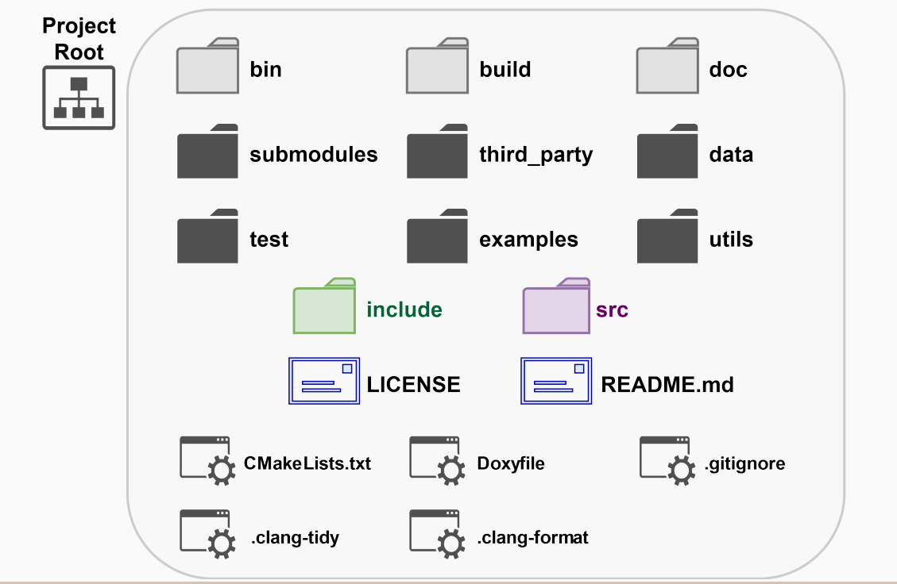

本系列文档重点阐述公司在C++项目研发的技术规范要求，由C++专项委员会牵头组织制定，实施过程中，公司各研发项目组共创及维护。

|版本   |  发布时间  | 备注 |
|---|---| --- |
| 1.0.0  | 2024-03-25  | 结合公司过往C++标准规范进行讨论并修订 |

- [一、 项目目录结构规范阐述](#一-项目目录结构规范阐述)
  - [1.1 建议目录](#11-建议目录)
  - [1.2 可选目录](#12-可选目录)
  - [1.3 生成目录](#13-生成目录)
- [二、 项目文件命名规范（每个项目风格稳定统一）](#二-项目文件命名规范每个项目风格稳定统一)
  - [大小写](#大小写)
  - [后缀名规范](#后缀名规范)
- [三、编码风格规范](#三编码风格规范)
  - [3.1 类名、成员函数名、普通函数名、命名空间名称](#31-类名成员函数名普通函数名命名空间名称)
  - [3.2 变量命名规范](#32-变量命名规范)
  - [3.3 编码格式规范](#33-编码格式规范)
- [四、代码注释规范](#四代码注释规范)
- [五、 技术实现规范（强制要求）](#五-技术实现规范强制要求)
  - [5.1 通用规则](#51-通用规则)
  - [5.2 函数](#52-函数)
  - [5.3 类](#53-类)
- [六、技术实现规范（实践建议）](#六技术实现规范实践建议)
  - [6.1 通用规则](#61-通用规则)
  - [6.2 类](#62-类)
  - [6.3 函数](#63-函数)

### 一、 项目目录结构规范阐述

 
[参考自Modern CPP Programming - Common Project Organization](https://github.com/federico-busato/Modern-CPP-Programming)

- 此部分规范在新建项目中，作为规范指引参考，后续提供的自动化工具链也基于以下目录结构（具体到文件目录名及大小写）进行开发。
- 针对当前已有项目，不强制要求完全统一至如下目录结构。
- 但是，**本届C++专项工作计划内，需要各个在研项目模块内部做到整体风格统一**。

#### 1.1 建议目录

| 目录文件名      |  说明           |
| ------------- |:-------------|
| ***include***     | 项目公共头文件 |
| ***src***     | 项目源代码实现文件及私有头文件 |
| ***test***     | 项目单元测试代码 |
| ***README.md***     | 项目介绍文档 |
| ***CMakeLists.txt***     | 项目编译脚本入口文件 |
| ***Doxyfile***     | 项目注释文档化配置脚本 |
| ***.clang-tidy***     | 代码静态检查配置文件 |
| ***.clang-format***     | 项目代码格式规范配置文件 |

#### 1.2 可选目录

| 目录文件名      |  说明           |
| ------------- |:-------------|
| ***examples***     | 项目组件示例代码 |
| ***utils***     | 项目自动化的一些工具脚本 |
| ***cmake***     | 项目配置的CMake功能函数脚本 |
| ***doc***       | 项目文档目录 |
| ***submodules***     | 源代码级别引用的公司内部其他项目模块 |
| ***third_party***     | 项目依赖的外部库（包括公司外部的第三方库以及公司内部已二进制发布出的组件库） |
| ***data***     | 单元测试所需的数据文件 |

#### 1.3 生成目录

| 目录文件名      |  说明           |
| ------------- |:-------------|
| ***bin***     | 项目编译输出的可执行文件目录 |
| ***build***     | 编译中间文件输出目录 |

---

### 二、 项目文件命名规范（每个项目风格稳定统一）

#### 大小写

- 已有项目中，以大驼峰为主，**在本届专项工作计划中，各在研项目模块需要做到内部命名规范统一**。
- 在新建项目中，以小写加下划线(`my_class.h`)为标准规范，以避免跨平台时大小写敏感问题。

#### 后缀名规范

- 已有项目中，保持当前的后缀名，不做强制修改。
- 新建项目模块中：
  - C API模块，头文件后缀名为.h，实现文件后缀名为.c。
  - C++模块，头文件后缀名.h 或.hpp（项目内部应该统一）, 实现文件后缀名为.cpp。

---

### 三、编码风格规范

在项目目录结构名称及文件名称规范基础上，此部分主要阐述代码实现过程中的命名规范。

- 以下命名规范在新项目中，作为指引规范执行。
- 在研项目中，不完全以下命名规范的不做强制统一。
- **但是，本届C++专项工作计划内，需要各个在研项目模块内部做到整体规范统一**。

#### 3.1 类名、成员函数名、普通函数名、命名空间名称

- 以大驼峰为命名规范，缩写词全部大写：

  ``` cpp
  void FunctionName();

  class ClassName
  {
  public:
      void MemberFunctionName();
  };

  class CADView
  {
  public:
      void MemberFunctionName();
  };
  ```
- 使用缩写名称时，应该使用哪些被熟知的名称（如 CAD、CAM、NURBS、IO、NC）。不建议自定义缩写（例如 Grp、AdjFace）

- 后续新建项目中**不要写**`T`这样的前缀。
  ``` cpp
  // 不要这样写
  class TClassName
  {
  public:
      void MemberFunctionName();
  };
  ```
- 鼓励在项目中使用命名空间，命名空间的名称统一为小写，后续标准中，将联合各项目组制定公司命名空间的命名规范标准。
  ```cpp
  namespace cad // 项目
  {
  namespace core // 模块
  {

  class ClassName
  {
      // some codes
  };

  }
  }
  ```

#### 3.2 变量命名规范

当前各类IDE对于变量数据类型的推导及智能提示比较完备，在变量名中指示变量类型的命名习惯（类似 p表示指针，d表示double等）不做强制要求。
结合公司各类项目整理分析，整理了如下的变量命名规范：
|    分类     | 说明           | 示例  | 备注  |
| ------------- |:-------------| -------| -----:|
|  **代码文件格式**     | 统一为UTF-8 | / | 以防止代码注释乱码问题（[VS设置文件编码格式](https://docs.fscut.com/pages/viewpage.action?pageId=265299677)） |
| **常量命名**      | 以'k'开头，伴随以大驼峰变量名称表达      |   `const int k_days_in_week = 7` |  |
| **枚举命名**      | 以大驼峰变量名称表达      |   `enum class MyEnum {EnumVar1, EnumVar2}` |  |
| **全局变量**      | 以'g_'开头，伴随以大驼峰变量名称表达      |   `MyGlobalObjectType g_global_instance`  |
| **静态成员变量**   | 以's_'开头，伴随以大驼峰变量名称表达      |   `class MyClass { static int s_member; }`  |
| **普通成员变量**      | 以m_开头，以下划线分割，全小写      |   `class MyClass { int m_member_data; }`  |   |
| **局部变量/参数变量**      | 以下划线分割，全小写      |   `int tmp_var`  |   |
| **缩写**      | - 下划线时，全小写<br> - 驼峰多单词缩写，全大写<br> - 单个单词缩写，首字母，其他小写      |   `m_cad_view`<br>`CADView()`<br>`TempDir()`  |   |

#### 3.3 编码格式规范

通过标准统一的.clang-format配置进行格式自动排版

- 每行长度不宜超过 120 个字符，不要出现制表符，每行缩进 4 格;
- 一级缩进4个空格，默认一个Tab就是4个空格，不要使用Tab。
- 预处理指令不要缩进, 从行首开始。
- 倾向于不在圆括号内使用空格. 关键字 if 和 else 另起一行。
  ```cpp
  if (condition)
  {
      // codes
  }
  else if (condition)
  {
      // codes
  }
  else
  {
      // codes
  }
  ```
-  if /else 以及switch/case 中如果某一个分支使用了花括号"{}"，则所有的分支都应该使用，不可部分分支使用。
   ```cpp
    // 不要这样写
    if (condition)
    {
        // codes
    }
    else if (condition)
        // code
    else
        // code
    
    // 也不要这样写 
    switch (choice) 
    {
    case 1:
    {
        // codes
        break;
    }
    case 2:
        // codes
        break;
    default:
        // codes
        break;
    }


    // 要这样写（都加上 "{}"）：
    if (condition)
    {
        // codes
    }
    else if (condition) 
    {   // 即使只有一行代码，也要加上 {}
        // code
    }
    else
    {   // 即使只有一行代码，也要加上 {}
        // code
    }

    switch (choice) 
    {
    case 1:
    {
        // codes
        break;
    }
    case 2:
    {
        // codes
        break;
    }
    default:
    {
        // codes
        break;
    }
    }

    // 或者这样写（都不加 "{}"）：
    if (condition)
        // code
    else if (condition) 
        // code
    else
        // code

    switch (choice) 
    {
    case 1:
        // codes
        break;
    case 2:
        // codes
        break;
    default:
        // codes
        break;
    }
    ```
- 指针和引用表达式：句点或箭头前后不要有空格. 指针/地址操作符 (*, &) 之后不能有空格。
  ```cpp
  int a = 1;
  int* b = & a // 不要这样写

  int* b = &a // 要这样写
  ```
- 文件最后空一行
- 连续空行数量**不要**大于1，例如：
  ```cpp
  // 不要这样写
  void DoSomething()
  {
      // codes


      // codes 
  }
  ```
- [详细格式规范及自动化工具使用参见](https://docs.fscut.com/pages/viewpage.action?pageId=261323925)

---

### 四、代码注释规范

所有public的类、函数都应该加注释。注释规范满足Doxyen生成代码文档。

- **整体风格**
整体代码注释风格参照 javadoc style，通过doxygen生成代码注释文档。此为CAD团队在代码注释及文档代码化实践示例： [FsWebCAD 文档](https://wiki.fsdev.cn/cad/FsWebCAD/class_fs_geometry2_d.html)

  ``` cpp
  /**
  * 注释内容
  */

  int test_var = 0; // 此处为单行注释示例

  // TODO: Fix me later
  
  ```
  
- **文件注释**
  参照以下模板，可在VS Code中配置Doxygen快捷键生成，Doxygen在VS Code插件中配置如下所示：
  
  ``` json
  {
    "doxdocgen.file.copyrightTag": [
            
        "==================================================================================",
        "                     Copyright (c) 2024 Friendess Co., Ltd.                       ",
        "                         Unpublished - All rights reserved                        ",
        "This software is confidential and proprietary product of Friendess Co., Ltd,      ",
        "protected by copyright law and international conventions.                         ",
        "Unauthorized reproduction or distribution of this program or any part thereof will",
        "be subject to severe legal sanctions, and will also be prosecuted to the maximum  ",
        "extent possible under the law.                                                    ",
        "==================================================================================",
    ],
   
    "doxdocgen.generic.authorEmail": "lijichao@fscut.com",
    "doxdocgen.generic.authorName": "li jichao",
    "doxdocgen.generic.authorTag": "@author       : {author}",
    "doxdocgen.file.fileOrder": [
        "copyright", "author","date", "file"
    ],
    "doxdocgen.generic.dateTemplate": "@date         : {date} \n==================================================================================",
    "doxdocgen.file.fileTemplate": "@file         : \n=================================================================================="
  }
  ```

  代码中在文件头，输入`/**`按回车后生成的效果如下：

    ``` cpp
    /**
   * ==================================================================================
   *                      Copyright (c) 2024 Friendess Co., Ltd.                       
   *                          Unpublished - All rights reserved                        
   * This software is confidential and proprietary product of Friendess Co., Ltd,      
   * protected by copyright law and international conventions.                         
   * Unauthorized reproduction or distribution of this program or any part thereof will
   * be subject to severe legal sanctions, and will also be prosecuted to the maximum  
   * extent possible under the law.                                                    
   * ==================================================================================
   * @author    ：li jichao
   * @date      ：2024-03-11
   * ==================================================================================
   * @file      ：
   * 
   * ==================================================================================
   */
    ```

- **类注释**

  ``` cpp
    /**
    * @ingroup FsMathBase                 // 注：将函数、类、结构或命名空间分组到逻辑组中
    * @brief 2D坐标轴
    * @details
    * 描述2D空间下的坐标轴
    * 轴的定义：
    *  - 原点 ( FsPoint2D , referred to as Location)
    *  - 单位向量 （ FsDirection2D , referred to as Direction)
    * 
    * 用处：
    *  - 定义几何变化（旋转轴，对称轴）
    */
  ```

  - 指定ingroup 内容，自动文档中会将Class 进一步分类，方便查看
  - brief 和 details 内容必须填写，格式参照以上示例
  - 在注释里说明相应成员时，直接使用类名，会自动超链接 （ 如 FsPoint2D )
  - [完整的Doxygen 类文档描述](https://www.doxygen.nl/manual/lists.html)
  
- **函数注释**

  ``` cpp
    /**
    * @brief 判断是否同轴
    * @param axi 给定的轴
    * @param distance_tolerance 长度误差
    * @param angle_tolerance 角度误差
    * @return 同轴返回 true，否则返回 false
    */
    bool IsCoaxial(const Axis& axi, double distance_tolerance, double angle_tolerance) 
  ```

  - 一定要描述参数表达
  - 公式用latex表示，描述参数范围，并指明参数含义 
  - 如果有return 一定要加
  - 模板参数用@tparam

- 对那些临时的, 短期的解决方案, 或已经够好但仍不完美的代码使用 `// TODO` 注释.

---

### 五、 技术实现规范（强制要求）

#### 5.1 通用规则

- 头文件避免重复编译使用 `#pragma once`

- 头文件引用应该能够自给自足（self-contained, 也就是可以作为第一个头文件被引入）。可在[Visual Studio 配置头文件检查](https://learn.microsoft.com/zh-cn/cpp/ide/include-cleanup-config?view=msvc-170)或者使用[第三方库](https://github.com/include-what-you-use/include-what-you-use)。

- 项目中不要通过相对路径引(../)用头文件。
  ```cpp
  // 不要这样写
  #include "../../header.h"
  ```

- 模块中导出的类和函数：
  - 在Windows平台中，必须通过宏定义 __declspec(dllexport)/ __declspec(dllimport)， 不可在函数声明中直接使用 __declspec(dllexport);
  - 每个模块各自定义自身的符号导出宏定义名称，不可直接使用其他模块的宏定义名称。
  - 宏实现的过程中要考虑跨平台兼容。

    例如：
    ``` cpp
    // 在某个头文件中定义如下内容：
    #if defined(_WIN32)
    #if defined(MAIN_APP_EXPORTS)
    #define MAIN_APP_API         __declspec(dllexport)
    #define MAIN_APP_API_EXTERN  __declspec(dllexport) extern
    #define MAIN_APP_API_EXTERNC extern "C" __declspec(dllexport)
    #else
    #define MAIN_APP_API         __declspec(dllimport)
    #define MAIN_APP_API_EXTERN  __declspec(dllimport) extern
    #define MAIN_APP_API_EXTERNC extern "C" __declspec(dllimport)
    #endif // end of MAIN_APP_EXPORTS
    #else // UNIX
    #if defined(MAIN_APP_EXPORTS)
    #define MAIN_APP_API
    #define MAIN_APP_API_EXTERN  extern
    #define MAIN_APP_API_EXTERNC extern "C"
    #else
    #define MAIN_APP_API         __declspec(dllimport)
    #define MAIN_APP_API_EXTERN  extern
    #define MAIN_APP_API_EXTERNC extern "C"
    #endif // end of MAIN_APP_EXPORTS
    #endif // end of _WIN32

    // 使用：
    // 生成 dll 时在项目对应的 CMakeLists.txt 中添加 target_compile_definitions(${target_name} PRIVATE MAIN_APP_EXPORTS)
    // 使用该 dll 时不需要定义 MAIN_APP_EXPORTS
    class MAIN_APP_API ClassName
    {
    public:
        void MemberFunctionName();
    };

    MAIN_APP_API_EXTERN void DoSomething();
    ```

- 编译警告 默认设置为错误处理，对于无法避免的 warning，显式指定忽略特定的编译警告。

- 不要在命名空间 std 内声明任何东西, 包括标准库的类前置声明. 在 std 命名空间声明实体是未定义的行为, 会导致如不可移植。

- 项目模块对外以返回码为主，项目模块不要向外抛出异常。参考[返回值技术方案调研](https://docs.fscut.com/pages/viewpage.action?pageId=261316178)。

- 空指针一律使用nullptr，而不是NULL或者0, 指针解引用之前一定要判断是否为nullptr。

- 浮点数大小比较表达要基于合理的容差设置，不要直接进行运算符比较。
  ```cpp
  double x = ...
  double y = ...

  // 不要这样写
  if (x == y)
      ...

  // 要这样写
  if (std::abs(x - y) < e-13)
      ...
  ```

- 整数类型变量在使用过程中，要明确具体类型(uint8_t, int32_t, etc.)。

- 魔数的使用除公认涵义外，应给出明确说明解释。

- 不要对bool值比较是否等于 true/false。
  ```cpp
  // 不要这样写
  bool is_visible = ...

  if (is_visible == true)
      ...
  ```

- 容器是否为空的判断使用 `empty()`。
  ```cpp
  std::vector<int> container;

  // 不要这样写
  if (0 == container.size())
      ...

  // 要这样写
  if (container.empty())
      ...
  ```

- 对于迭代器和其他模板对象使用前缀形式 (++i) 的自增, 自减运算符，避免针对对象迭代器进行运算时拷贝对象带来的开销。

#### 5.2 函数

- 传参：
  - 对于 built-in 类型、智能指针、自定义的拷贝廉价的类型，可直接值传递，不需要要使用 const 修饰符及 "&"。
    ```cpp
    // 不要这样写
    void DoSomething(const bool& flag);

    void DoSomething(const std::shared_ptr<Widget>& widget);

    void DoSomething(const Handle(AIS_Shape)& shape);

    struct Point2D
    {
        double x;
        double y;
    }
    void DoSomething(const Point2D& point);

    enum class ResultType
    {
        ...
    };
    void DoSomething(const ResultType& type);
    ```

  - 参数对象优先使用引用传递，其次是指针传递，避免值传递。
  - 参数对象为引用或者指针时，const 修饰符应用尽用。
  - 函数参数名称在声明和定义中要保持一致。
  - 类成员函数如果不改变其成员变量，则也应该为其声明为 const
    ```cpp
    // 要这样写
    class Person
    {
    public:
        int GetAge() const;
        std::string GetName() const;
        const Person* GetSibling() const;

    private:
        int m_age;
        std::string m_name;
        Person* m_sibling { nullptr };   // 指针类型的成员变量
    }
    ```

  - 参数名称**不要**带前缀，例如
    ```cpp
    // 不要这样写：
    void DoSomething(const std::string& a_file_name);

    // 直接写成：
    void DoSomething(const std::string& file_name);
    ```
- 返回：
  - 如果函数返回错误码或有明确的报错，调用者必须处理。
  - 模块API统一使用返回码[技术方案](https://docs.fscut.com/pages/viewpage.action?pageId=261316178)
  - 函数返回类对象或者容器内的数据时，并根据是否允许修改加上必要的 const 修饰符。
  - buil-in 类型直接返回值类型。
    ```cpp
    class ClassName
    {
    public:
        int GetAge() const;

        std::string GetName();
        const std::string& GetName() const;
        // std::string& GetName(); 请勿提供这样的接口

        ClassName* GetParent();
        const ClassName* GetParent() const;
        // ClassName* GetParent() const;  也不建议提供这样的接口
    };
    ```
  - 函数如果返回内部的临时变量是匿名对象，即 URVO(unnamed return value optimization)：
    - 可以直接返回值类型。自 MSVC 2005/ GCC 4.1.2 开始支持
    - URVO 自 C++ 17 成为必须满足项。
  - 函数如果返回的内部临时变量是有名字的对象，即 NRVO：
    - 此部分在C++ 17标准未作为编译器必须满足项提出。
    - GCC 将 NRVO 默认打开支持，而 MSVC 需要在开启 O2 优化选项时才打开支持
    - 如果函数执行逻辑的不同分支有不同的命名临时对象返回，MSVC/GCC 在所有优化选项中不支持 NRVO。
  - 关于 RVO、NRVO，[此篇文章做了较详细的实验](https://sigcpp.github.io/2020/06/08/return-value-optimization)
  - 在不能很好支持 RVO 的情形下，函数需通过指针返回对象类型，内存管理上：
    - 需要遵循谁创建，谁释放的原则。
    - 如果需要转移内存所有权，将返回值类型设为 unique_ptr。

#### 5.3 类

- 定义为class 还是 struct?:
  - 不变式（invariant）：比如年月日，他们是有约束条件的，当满足约束条件的时候是成立的，不可单独被修改（2月变成了31天而年份不变，是逻辑上错误的），所有是不允许公开修改的，需要通过一个成员函数带检查的修改。
  - struct 用于不需要建立对象的不变式状态时，其他情况一律使用 class。参考邓凯提供的[这篇文章](https://embeddedartistry.com/fieldatlas/how-non-member-functions-improve-encapsulation/)关于class封装的作用。

- 类声明顺序：
  - 类的访问控制区段的声明顺序依次为: public、 protected、private
  - 类的访问控制关键字不要缩进
    ```cpp
    // 不要这样写
    class ClassName
    {
        public:
        // codes
  
        protected:
        // codes
  
        private:
        // codes
    };
  
    // 要这样写
    class ClassName
    {
    public:
        // codes
  
    protected:
        // codes
  
    private:
        // codes
    };
    ```
  - 类型 (包括 typedef, using 和嵌套的结构体与类), 常量, 工厂函数, 构造函数, 赋值运算符, 析构函数, 其它函数, 数据成员。
    ```cpp
    class ClassName
    {
        struct Buffer
        {
            // codes
        };

    public:
        using ClassNamePtr = std::shared_ptr<ClassName>;

        static ClassNamePtr Create();

        ClassName();
        ClassName(const ClassName& other);
        ClassName& operator=(const ClassName& other)

        virtual ~ClassName();

        void Initialize();
        void DoSomething();

    protected:
        virtual void Update();

    private:
        int m_value;
    };
    ```
- 构造函数：
  - 不要在构造函数中调用虚函数, 也不要在无法报出错误时进行可能失败的初始化。
  - 如果对象需要进行有意义的 (non-trivial) 初始化, 考虑使用明确的 Init() 方法或使用工厂模式。
- 不要对虚函数使用默认参数值。
- 如果类有虚函数声明，那应该将析构函数定义为虚函数
- 不要定义隐式类型转换. 对于转换运算符和单参数构造函数, 请使用 explicit 关键字。
  ```cpp
  class ClassName
  {
  public:
      explicit ClassName(ClassName* parent = nullptr);
      virtual ~ClassName();
  };
  ```
- 如果你的类型需要不可被复制、移动，选择 `delete` 相应运算符和构造函数(`MyClass(const MyClass&) = delete;`)，并显式写明其他特殊函数，`default` or 定义。 
  ```cpp
  class ClassName
  {
  public:
      ClassName();
      ClassName(const ClassName& other) = delete;
      ClassName(ClassName&& other) = default;;
  };
  ```
- 对于重载的虚函数或虚析构函数, 使用 `override` 关键字显式地进行标记。重载的函数不需要声明 `virtual`
  ```cpp
  class Base
  {
  public:
      Base();
      virtual ~Base();

      virtual void Update();
  };

  class Derived : public Base
  {
  public:
      Derived();
      ~Derived();

      void Update() override;

      // 不需要写成
      // virtual void Update() override;
  };
  ```
- 对象复用：
  - 使用组合 (这一点也是 GoF 在 \<Design Patterns> 里反复强调的) 常常比使用继承更合理。
  - 如果使用继承的话, 定义为 public 继承。
  - 除接口继承(C++ 中为纯虚函数声明)外，不要进行多继承。

---

### 六、技术实现规范（实践建议）

C++技术庞杂，实践建议做不到面面俱到，C++技术类丛书给出了不少好的实践建议，本届专委会将组织各类专题讨论进行技术分享和培训。[C++核心指南](https://isocpp.github.io/CppCoreGuidelines/CppCoreGuidelines)建议大家作为平常参考必备。

#### 6.1 通用规则

- 头文件引用顺序建议:

  ``` cpp
  //实现文件对应的头文件
  #include "foo/public/fooserver.h"
    
  //C库
  #include <sys/types.h>
  #include <unistd.h>
    
  //C++库
  #include <hash_map>
  #include <vector>
    

  //其他第三方库，如QT,OCCT，OpenCV
  //团队的其它公共库，比如 bcvlib
  #include <opencv/cv.h>
  #include <TopoDS_Edge.hxx>
  #include <TopoDS_Face.hxx>
  
  //此解决方案内的其它项目，比如B依赖A，A项目的头文件
    
  //项目内其它头文件
  #include "base/basictypes.h"
  #include "base/commandlineflags.h"
  #include "foo/public/bar.h"
  ```

- 在引入头文件时，最好能注释说明要引用的主要API是什么：

  ``` cpp
  #include "my_class.hpp" // MyClass

  #include <cmath> // std::fabs()
  #include <iostream> // std::cout
  #include <vector> // std::vector

  #include "my_dir/my_headerA.hpp" // npA::ClassA, npB::f2()
  #include "my_dir/my_headerB.hpp" // np::g()
  ```

- 时刻记得及时取消宏定义: `#undef`

- 优先考虑使用 `#if defined(MACRO)` ，而不是 `#ifdef`，增强可读性的同时，支持多重条件的判断

  ```cpp
  #if defined(MACRO1) && defined(MACRO2)
  ```

- 不要在命名空间中内定义宏，会造成歧义，所定义的宏不属于实际上不属于命名空间
  ```cpp
  // 不要这样写
  namespace core
  {
  #define ROBOT_NAME "name"
  }
  ```

- 变量命名可参照 [编程常用缩写](https://docs.fscut.com/pages/viewpage.action?pageId=27558029)

- 倾向于按值返回， 否则按引用返回。 避免返回指针。

- 尽可能用 sizeof(varname) 代替 sizeof(type)，避免变量类型更改后代码不兼容
  ```cpp
  class Widget
  {
      // codes
  };
  Widget w;

  // 不建议这样写
  int size = sizeof(Widget);

  // 建议这样写
  int size = sizeof(w);
  ```

#### 6.2 类

- 将所有数据成员声明为 private，除非是 static const 类型成员。

#### 6.3 函数

- 内联应用于不超过 10 行的函数体
- 尽可能使用 enum 对于整形参数进行封装
- 如果参数数目过多，建议通过结构体进行包装
- 优先通过返回值，而不是通过参数返回结果
- 函数参数如果较多，换行写，保持参数列对齐，提高可读性
- 避免冗余的执行流程
  **不好的示例**：
  
  ``` cpp
  if (condition)
  {
      // codes
      return;
  }
  else
  {
      // codes
  }
  ```

  **好的示例**
  
  ``` cpp
  if (condition)
  {
      // codes
      return;
  }
  
  // codes
  ```
